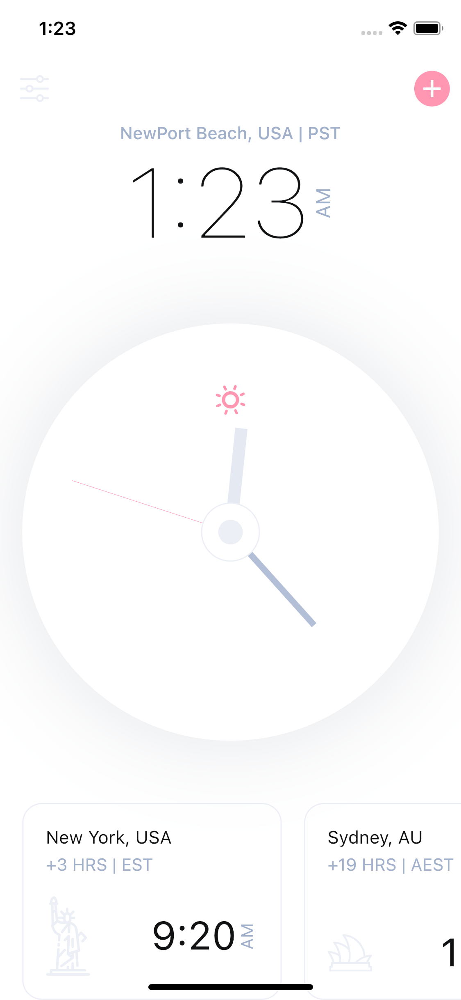
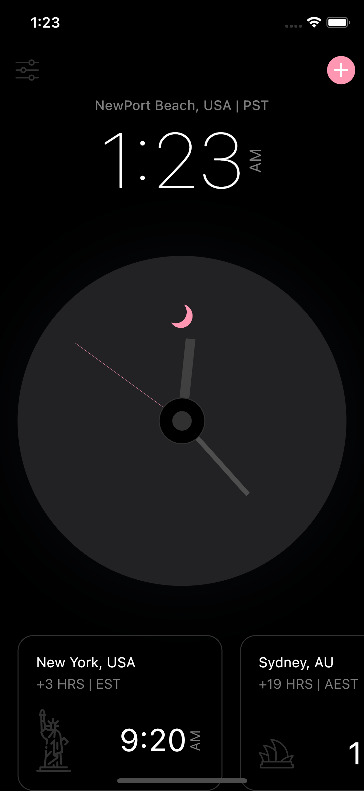

# Analog Clock

used flutter 2.7 (not null safety)  
tested on ios Simulator with iOS version 15.  
references video source below.

## Previews

---

## References
https://www.youtube.com/watch?v=u6Cfzng3Gek

some assets are from github located in corresponding youtube link's subtitle.
